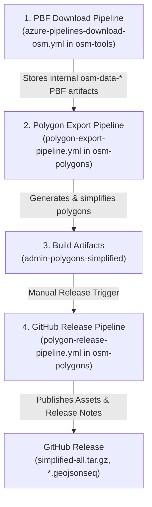

# osm-polygons

## City outline polygons
OpenStreetMap offers geo data in raw data form. For building services you usually have to preprocess the data.
This project takes OSM's raw data, extracts all administrative boundaries and converts them as polygons.

[](../../blob/master/examples/palling.geojson)

## GeoJSON
Here's an example of one of the exported GeoJSON objects:
```
{
  "type": "FeatureCollection",
  "features": [
    {
      "type": "Feature",
      "properties": {
        "name": "Palling",
        "boundary": "administrative",
        "wikidata": "Q262325",
        "wikipedia": "de:Palling",
        "admin_level": "8",
        "de:regionalschluessel": "091890134134",
        "TMC:cid_58:tabcd_1:Class": "Area",
        "TMC:cid_58:tabcd_1:LCLversion": "8.00",
        "TMC:cid_58:tabcd_1:LocationCode": "4457",
        "de:amtlicher_gemeindeschluessel": "09189134"
      },
      "geometry": {
        "type": "Polygon",
        "coordinates":[[[12.5950766,47.9703637],[12.5953607,47.9727103],[12.6019791,47.9734364],[12.6054816,47.9756447],[12.6051771,47.9866313],[12.6019101,47.9920364],[12.6015149,48.0000915],[12.6038957,48.0018881],[12.6037128,48.0075969],[12.6080557,48.008038],[12.6067195,48.0110004],[12.6028389,48.0123523],[12.6106511,48.0155409],[12.6186272,48.0264337],[12.6133034,48.0266815],[12.6128961,48.0335542],[12.6155784,48.0330894],[12.6163547,48.0450822],[12.6224712,48.0447456],[12.6224326,48.0468012],[12.6300164,48.0474926],[12.6322431,48.049497],[12.6424822,48.0472457],[12.6451302,48.0475784],[12.6444189,48.0490697],[12.6518457,48.0493225],[12.6564979,48.0476141],[12.6741239,48.0467782],[12.6740106,48.0452744],[12.6816377,48.0458961],[12.6860289,48.0349076],[12.6826671,48.0341289],[12.6856407,48.0294477],[12.6825498,48.0252175],[12.6879822,48.0208599],[12.6911325,48.0219263],[12.6997735,48.0196999],[12.7034477,48.0119514],[12.6993748,48.0120405],[12.6979668,48.0101224],[12.7045551,48.0053099],[12.7061879,48.0062688],[12.7034737,47.9975493],[12.6958825,47.9946762],[12.6934753,47.9865004],[12.6894097,47.9856878],[12.6838769,47.9870427],[12.6761276,47.9840457],[12.6756879,47.979062],[12.6715428,47.9792927],[12.6697612,47.9762248],[12.6723981,47.9721122],[12.6678208,47.9695303],[12.6621719,47.9716884],[12.6592149,47.9703283],[12.6603152,47.9655514],[12.6566373,47.9625804],[12.6586512,47.9613793],[12.6574203,47.9598177],[12.6499559,47.959509],[12.6499691,47.9567339],[12.6433613,47.9602092],[12.6377472,47.9595468],[12.6376127,47.9616367],[12.6321195,47.9624504],[12.6286777,47.9658774],[12.6316785,47.9680828],[12.628837,47.9730173],[12.5969356,47.968864],[12.5950766,47.9703637]]]}
    }
  ]
}
```

## Pipeline Architecture & Release Workflow

The polygon export and release workflow is organized across three interconnected Azure DevOps pipelines and GitHub Releases:



### Pipeline Overview

1. **PBF Download Pipeline (`azure-pipelines-download-osm.yml` in `osm-tools`)**
   - Downloads 169 region PBF extracts worldwide from Geofabrik.
   - Stores internal PBF extracts as pipeline artifacts (`osm-data-<region>`).
   - Supports incremental cache-reuse to preserve existing byte-for-byte baseline PBF data.


2. **Polygon Export Pipeline (`polygon-export-pipeline.yml` in `osm-polygons`)**
   - **Export Stage**: Filters administrative boundary relations (`boundary=administrative`) using `osmium-tool`.
   - **Simplify Stage**: Runs `CoverageSimplifier` from `osm-tools` in Docker (`krizleebear/osm-tools:latest`) to simplify geometries while preserving topology, tags, and maritime coastline buffers (~1.1 km into the sea).
   - **Package Stage**: Packages all continental archives (`simplified-<continent>.tar.gz`) and individual country `.geojsonseq` files into a unified global archive (`simplified.tar.gz`) with full build metadata (`build-info.json`).

3. **Standalone Manual GitHub Release Pipeline (`polygon-release-pipeline.yml` in `osm-polygons`)**
   - **Manual Trigger**: Executed on-demand (`trigger: none`) when a verified build is ready for release.
   - **Traceability**: Generates GitHub Release notes containing a Markdown traceability matrix linking directly to exact Git commit SHAs of both `osm-tools` and `osm-polygons`.
   - **Assets**: Uploads `simplified-all.tar.gz`, continental archives (`simplified-*.tar.gz`), and individual country `.geojsonseq` stream files.

## License
This osm-polygons data is made available under the Open Database License: http://opendatacommons.org/licenses/odbl/1.0/. Any rights in individual contents of the database are licensed under the Database Contents License: http://opendatacommons.org/licenses/dbcl/1.0/

## Reverse Geocoding (what's here?)
The polygons offered by this project can e.g. be used to draw the outlines of your city.
Or perform reverse geocoding: Take a point on a map and resolve its administrative membership: City, County, State and City.
My other open source project https://github.com/krizleebear/osm-tools provides tools to do that in Java.
So if you're trying to reverse-geocode huge amounts of data, voilá.

### License considerations
Be aware that you must adhere to ODbL (as stated above) also while reverse geocoding. There's a special guide for that: https://wiki.osmfoundation.org/wiki/Licence/Community_Guidelines/Geocoding_-_Guideline


https://github.com/krizleebear/osm-polygons/releases/tag/v1.0

