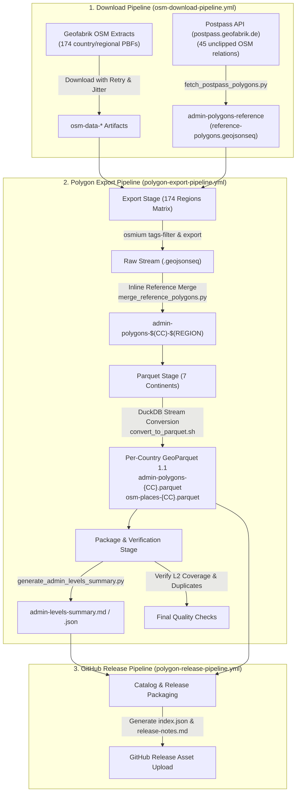

# osm-polygons

## City outline polygons
OpenStreetMap offers geo data in raw data form. For building services you usually have to preprocess the data.
This project takes OSM's raw data, extracts all administrative boundaries and converts them as polygons.

[](../../blob/master/examples/palling.geojson)

## GeoJSON
Here's an example of one of the exported GeoJSON objects:
```
{
  "type": "FeatureCollection",
  "features": [
    {
      "type": "Feature",
      "properties": {
        "name": "Palling",
        "boundary": "administrative",
        "wikidata": "Q262325",
        "wikipedia": "de:Palling",
        "admin_level": "8",
        "de:regionalschluessel": "091890134134",
        "TMC:cid_58:tabcd_1:Class": "Area",
        "TMC:cid_58:tabcd_1:LCLversion": "8.00",
        "TMC:cid_58:tabcd_1:LocationCode": "4457",
        "de:amtlicher_gemeindeschluessel": "09189134"
      },
      "geometry": {
        "type": "Polygon",
        "coordinates":[[[12.5950766,47.9703637],[12.5953607,47.9727103],[12.6019791,47.9734364],[12.6054816,47.9756447],[12.6051771,47.9866313],[12.6019101,47.9920364],[12.6015149,48.0000915],[12.6038957,48.0018881],[12.6037128,48.0075969],[12.6080557,48.008038],[12.6067195,48.0110004],[12.6028389,48.0123523],[12.6106511,48.0155409],[12.6186272,48.0264337],[12.6133034,48.0266815],[12.6128961,48.0335542],[12.6155784,48.0330894],[12.6163547,48.0450822],[12.6224712,48.0447456],[12.6224326,48.0468012],[12.6300164,48.0474926],[12.6322431,48.049497],[12.6424822,48.0472457],[12.6451302,48.0475784],[12.6444189,48.0490697],[12.6518457,48.0493225],[12.6564979,48.0476141],[12.6741239,48.0467782],[12.6740106,48.0452744],[12.6816377,48.0458961],[12.6860289,48.0349076],[12.6826671,48.0341289],[12.6856407,48.0294477],[12.6825498,48.0252175],[12.6879822,48.0208599],[12.6911325,48.0219263],[12.6997735,48.0196999],[12.7034477,48.0119514],[12.6993748,48.0120405],[12.6979668,48.0101224],[12.7045551,48.0053099],[12.7061879,48.0062688],[12.7034737,47.9975493],[12.6958825,47.9946762],[12.6934753,47.9865004],[12.6894097,47.9856878],[12.6838769,47.9870427],[12.6761276,47.9840457],[12.6756879,47.979062],[12.6715428,47.9792927],[12.6697612,47.9762248],[12.6723981,47.9721122],[12.6678208,47.9695303],[12.6621719,47.9716884],[12.6592149,47.9703283],[12.6603152,47.9655514],[12.6566373,47.9625804],[12.6586512,47.9613793],[12.6574203,47.9598177],[12.6499559,47.959509],[12.6499691,47.9567339],[12.6433613,47.9602092],[12.6377472,47.9595468],[12.6376127,47.9616367],[12.6321195,47.9624504],[12.6286777,47.9658774],[12.6316785,47.9680828],[12.628837,47.9730173],[12.5969356,47.968864],[12.5950766,47.9703637]]]}
    }
  ]
}
```

### Pipeline Architecture & Data Flow

The polygon export and release workflow is organized across two interconnected Azure DevOps pipelines in `osm-polygons` and automated GitHub Releases:



### Pipeline Overview

1. **OSM PBF & Reference Download Pipeline (`osm-download-pipeline.yml`)**
   - **PBF Downloads**: Downloads 174 country and regional OSM PBF extracts worldwide from Geofabrik with randomized startup jitter, exponential backoff, `--speed-limit` aborts on stalled streams, and `--continue-at -` resumption.
   - **Postpass Reference Fetcher (`fetch_postpass_polygons.py`)**: Fetches 45 intact sovereign state boundaries (Level 2), disputed/cross-border regions (Level 4), and island concelhos (Level 7) directly from the unclipped planet database at `postpass.geofabrik.de` into `admin-polygons-reference`.

2. **Polygon Export Pipeline (`polygon-export-pipeline.yml`)**
   - **Export Stage (174 parallel matrix jobs)**:
     1. Filters administrative boundaries (`boundary=administrative`) and sub-municipal places via `osmium tags-filter`.
     2. Extracts point features for OSM place nodes (`osm-places-*.jsonl`).
     3. Streams features through `filter_polygons.py` to synthesize missing admin levels and enrich admin center coordinates.
     4. **Inline Postpass Reference Merge (`merge_reference_polygons.py`)**: Automatically inserts or replaces damaged country polygons using the intact reference geometry.
   - **Parquet Stage (7 continental matrix jobs)**:
     - Converts `.geojsonseq` streams directly into per-country OGC GeoParquet 1.1 files (`admin-polygons-{CC}.parquet`) using DuckDB Spatial (ZSTD compressed, WGS84, bounding-box indexed).
   - **Package & Quality Stage**:
     - Verifies no duplicate country codes across continental boundaries.
     - Verifies Level 2 country polygon completeness.
     - Generates global `admin-levels-summary.md` and `.json` coverage reports.

3. **Standalone Manual GitHub Release Pipeline (`polygon-release-pipeline.yml`)**
   - **On-Demand Release**: Manually triggered when a build is validated.
   - **Catalog Index**: Generates machine-readable `index.json` catalog mapping every ISO country code and continent to its asset download URL.
   - **Release Publishing**: Publishes individual per-country `.parquet` files and place node datasets directly as GitHub Release assets.

## Administrative Hierarchy & Boundary Rescue

- **100% Intact National Boundaries (Level 2)**: Large cross-border countries (e.g. US, France, Spain, Monaco, China, Russia, Azerbaijan) whose national relations are clipped by Geofabrik regional bounding boxes are restored via Postpass planet queries.
- **Per-Country OGC GeoParquet 1.1**: Direct selective querying via DuckDB HTTP range requests without downloading monolithic multi-gigabyte archives.
- **Place Nodes Companion Dataset**: Includes settlements (cities, towns, villages, hamlets, suburbs, quarters) as point features (`osm-places-{CC}.parquet`).

### Querying Datasets with DuckDB

You can query remote release assets directly via HTTP range requests without downloading the entire file:

```sql
INSTALL spatial; LOAD spatial;
INSTALL httpfs; LOAD httpfs;

-- Point-in-Polygon administrative hierarchy lookup for Munich
SELECT admin_level, name, wikidata, iso3166_2
FROM read_parquet('https://github.com/krizleebear/osm-polygons/releases/download/v3.0.0/admin-polygons-DE.parquet')
WHERE bbox_minx <= 11.5761 AND bbox_maxx >= 11.5761
  AND bbox_miny <= 48.1371 AND bbox_maxy >= 48.1371
  AND ST_Contains(geom, ST_Point(11.5761, 48.1371))
ORDER BY admin_level;
```

## License

© OpenStreetMap contributors

This data is derived from OpenStreetMap data and is made available under the [Open Database License (ODbL)](https://opendatacommons.org/licenses/odbl/1.0/). Any rights in individual contents of the database are licensed under the [Database Contents License (DCbL)](https://opendatacommons.org/licenses/dbcl/1.0/).

