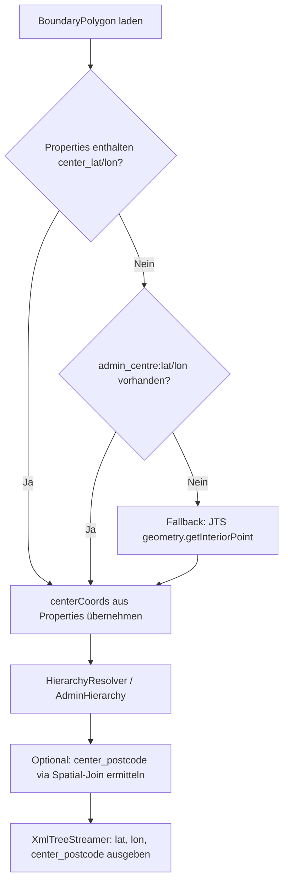

# 🏛️ Spezifikation & Implementierungsplan: Administratives Zentrum & Stadt-PLZ

Dieses Dokument spezifiziert das Konzept, die Datenfluss-Architektur und den Implementierungsplan zur Auflösung und Ausgabe von verifizierten administrativen Zentren (`centerpoint`) und Zentrums-Postleitzahlen (`center_postcode`) in `osm-polygons` und `osm-geocoder`.

---

## 📌 1. Problemstellung & Motivation

Aktuell werden Zentrumskoordinaten für administrative Einheiten (`<CITY>`, `<STATE>`, `<COUNTRY>`, `<CITYPART>`) im `osm-geocoder` über einen mathematischen JTS-Fallback (`geometry.getInteriorPoint()`) berechnet.

### Nachteile des rein mathematischen Ansatzes:
1. **Fehlende Zentrumsbedeutung:** Bei ausgedehnten, unregelmäßigen oder gewässerreichen Stadt- und Gemeindegrenzen liegt der geometrische Interior Point häufig in Wäldern, auf Feldern oder im Wasser.
2. **Kartografische Diskrepanz:** Kartendienste und Navigationssysteme platzieren die Stadtbeschriftung (Label) an markanten, besiedelten Punkten (z. B. Rathausplatz, historischer Ortskern).
3. **Fehlende Zentrums-PLZ:** Mehrere Postleitzahlen innerhalb einer Großstadt (z. B. München 80331 vs. 81249) erfordern die Identifikation der repräsentativen Haupt-Postleitzahl des Stadtzentrums.

---

## 🗺️ 2. OSM Datenbasis & Upstream-Erweiterung (`osm-polygons`)

In OpenStreetMap enthalten administrative Grenzrelationen (`type=boundary`, `boundary=administrative`) standardmäßig Relationsmitglieder (Knoten/Nodes) für das Zentrum:
- **`role=admin_centre`**: Repräsentiert den offiziellen Verwaltungssitz bzw. das Rathaus der Gemeinde.
- **`role=label`**: Repräsentiert den kartografischen Beschriftungspunkt.
- **Verknüpfte `place=*` Nodes**: Knoten mit `place=city|town|village|hamlet` und identischem Namen bzw. Wikidata-Tag.

### Spezifikation für Upstream `krizleebear/osm-polygons`:
Beim Export der vereinfachten Polygone in GeoJSON (`.geojsonseq`) und GeoParquet (`.parquet`) werden die Zentrumskoordinaten als Properties eingebettet:

```json
{
  "type": "Feature",
  "properties": {
    "@type": "relation",
    "@id": 62428,
    "name": "München",
    "admin_level": "6",
    "wikidata": "Q1726",
    "population": "1488202",
    "admin_centre:lat": 48.1374,
    "admin_centre:lon": 11.5755,
    "label:lat": 48.1371,
    "label:lon": 11.5754,
    "center_lat": 48.1374,
    "center_lon": 11.5755
  },
  "geometry": {
    "type": "Polygon",
    "coordinates": [ ... ]
  }
}
```

### Priorisierung im Exporter:
1. **`role=admin_centre`** (höchste Priorität)
2. **`role=label`** (Fallback, falls kein admin_centre vorhanden)
3. **`place=*` Node** (Fallback bei Namens-/Wikidata-Match)
4. *Kein Eintrag (`null`)*, wenn kein OSM-Knoten existiert (Downstream fällt dann auf JTS `getInteriorPoint()` zurück).

---

## 📐 3. Schema- & XML-Ausgabe (`osm-geocoder`)

### Schema-Erweiterung (`geocoder_data.xsd`):
Erweiterung des `<CITY>` Elements (sowie optional `<STATE>` und `<COUNTRY>`) um das optionale Attribut `center_postcode`:

```xml
<CITY id="101" source_id="osm:r62428" name="München" lan="de"
      lon="11.5755" lat="48.1374" center_postcode="80331"
      wikidata="Q1726" population="1488202">
  ...
</CITY>
```

*(Hinweis: `lat` und `lon` sind bereits im Schema für `<CITY>`, `<STATE>`, `<COUNTRY>`, `<CITYPART>` als Pflichtattribute definiert und werden mit den optimierten Zentrumskoordinaten befüllt).*

---

## 🔄 4. Downstream-Verarbeitung im `osm-geocoder`



### Komponenten-Anpassungen:
1. **`BoundaryPolygon` / `BoundaryPolygonParser` / `GeoParquetBoundaryReader`:**
   - Parsen von `center_lat`, `center_lon`, `admin_centre:lat`, `admin_centre:lon`, `label:lat`, `label:lon`.
   - Bei Vorhandensein: Initialisierung von `centerCoords` mit diesen Werten vor dem JTS-InteriorPoint-Fallback.
2. **`AdminHierarchy` & `GeocoderNode`:**
   - Durchreichen von `centerCoords` und ggf. `centerPostcode`.
3. **`XmlTreeStreamer`:**
   - Ausgabe von `center_postcode="..."` am `<CITY>` Element.

---

## 📋 5. Schritt-für-Schritt Implementierungsplan

- [x] **Phase 1: Upstream Issue & Release (`krizleebear/osm-polygons`)**
  - OPL-Extraktion in `filter_polygons.py` integriert, um `admin_centre` / `label` Member-Nodes aus der gefilterten `${ADMIN_PBF}` aufzulösen.
  - GeoParquet-Schema in `export_parquet.sql` und `SPEC_GEOPARQUET_ADMIN_POLYGONS.md` um `center_lat`, `center_lon`, `admin_centre_lat`, `admin_centre_lon`, `label_lat`, `label_lon` erweitert.
  - End-to-End Verifikation auf Testdaten durchgeführt.

- [ ] **Phase 2: Downstream Parser & Modell (`osm-geocoder`)**
  - `BoundaryPolygonParser` und `GeoParquetBoundaryReader` erweitern, um `center_lat`/`lon` aus Properties einzulesen.
  - Unit Tests in `BoundaryPolygonParserTest` und `PolygonCacheTest` ergänzen.

- [ ] **Phase 3: XML-Schema & Streamer (`osm-geocoder`)**
  - `geocoder_data.xsd` um optionales `center_postcode` an `<CITY>` erweitern.
  - `XmlTreeStreamer` anpassen, um `center_postcode` zu schreiben.
  - Schema-Validierungstests (`XmlSchemaValidationTest`) ausführen.

- [ ] **Phase 4: End-to-End Verifikation**
  - Batch-Run für Referenzländer (`MC`, `AT`, `DE`) durchführen.
  - Verifizieren, dass die Zentrumskoordinaten von Städten (z. B. München Rathausplatz 48.1374, 11.5755) exakt im erzeugten XML stehen.
