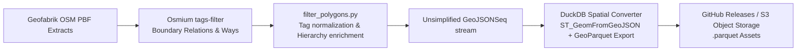

# Specification: Exact-Geometry GeoParquet Administrative Polygons

**Target Project:** `https://github.com/krizleebear/osm-polygons`  
**Downstream Projects:** `osm-geocoder`, spatial analytics, GIS consumers  
**Date:** 2026-08-23  
**Status:** Proposed Architecture  
**Related Issue:** [Issue #4: Simplified polygons bleed across national borders (no border snapping)](https://github.com/krizleebear/osm-polygons/issues/4)  

---

## 1. Executive Summary & Motivation

### 1.1 The Problem: Border Bleeding in Simplified Geometries
In `osm-polygons` v1.8.x, administrative polygon extracts are simplified using geometry reduction algorithms (Douglas-Peucker / Visvalingam-Whyatt via `CoverageSimplifier` in `osm-tools`). Because simplification runs independently per administrative polygon:
- Shared border vertices between adjacent sovereign states (e.g. Germany/Netherlands, France/Germany) and municipalities are displaced independently by up to tens of meters.
- This creates non-topological geometric slivers and overlaps along international borders.
- Downstream geocoders performing point-in-polygon (PIP) containment deterministically leak points of interest (POIs) across borders (e.g. Dutch windmills or postcodes resolving into German municipal containers).

### 1.2 The Proposed Solution: Unsimplified GeoParquet
Instead of performing lossy geometry simplification to reduce file size, we export **exact, unsimplified OpenStreetMap administrative polygons** directly into **GeoParquet (v1.1)** format:

1. **Zero Border Bleeding:** Because raw OSM relations share identical node coordinates along international boundaries, unsimplified polygons are 100% topologically consistent. Shared borders match perfectly with zero overlap or sliver gaps.
2. **Columnar Compression:** Parquet with Zstandard (ZSTD) compression and binary Well-Known Binary (WKB) coordinate encoding achieves file sizes comparable to or smaller than gzipped GeoJSON, while preserving full floating-point coordinate precision.
3. **Cloud-Native & Remote Queryable:** Consumers (via DuckDB, PyArrow, Polars, GeoPandas, GDAL) can execute spatial SQL filters directly against remote HTTP/S3 URLs with byte-range requests (predicate pushdown and column projection) without downloading multi-gigabyte archives.
4. **Pipeline Simplification:** Eliminates long-running, memory-heavy simplification matrix stages in CI/CD (e.g. Ireland with 65k historic townlands, Russia, France).

---

## 2. GeoParquet Schema Specification

The dataset adheres to the [OGC GeoParquet 1.1 Specification](https://geoparquet.org/) with CRS `OGC:CRS84` (WGS84 lon/lat).

### 2.1 Table Structure

| Column Name | SQL Type | Nullable | Description & Optimization |
|---|---|:---:|---|
| `continent` | `VARCHAR` | No | Continental grouping (`europe`, `asia`, `north-america`, etc.). Low cardinality (dictionary encoded). |
| `country_code` | `VARCHAR` | No | ISO 3166-1 alpha-2 code (`DE`, `FR`, `US`, etc.). Low cardinality (dictionary encoded). |
| `admin_level` | `TINYINT` | No | OSM administrative level (`2` to `11`). Primary filtering column. |
| `boundary` | `VARCHAR` | No | Primary boundary tag (`administrative`, `local_authority`, `borough`). |
| `osm_id` | `BIGINT` | No | OSM relation or way identifier (numeric component). |
| `osm_type` | `VARCHAR` | No | OSM entity type (`relation` or `way`). |
| `name` | `VARCHAR` | No | Primary localized name (`name` tag with fallback to `name:en` / `official_name`). |
| `name_en` | `VARCHAR` | Yes | English name (`name:en`). |
| `wikidata` | `VARCHAR` | Yes | Wikidata identifier (e.g., `Q64` for Berlin). |
| `iso3166_1` | `VARCHAR` | Yes | Country ISO code (for `admin_level=2`). |
| `iso3166_2` | `VARCHAR` | Yes | Regional / State ISO code (e.g. `DE-BY`). |
| `parent_osm_id` | `BIGINT` | Yes | Direct parent administrative relation/way ID (pre-computed hierarchical link). |
| `parent_iso3166_2` | `VARCHAR` | Yes | Parent regional / state ISO code (e.g. `DE-BY` for Bavarian municipalities). |
| `parent_name` | `VARCHAR` | Yes | Primary name of direct parent entity (e.g. `"Bayern"` for Munich). |
| `postal_code` | `VARCHAR` | Yes | Postal code or semicolon-separated list of postal codes (e.g. `"93051"` or `"80331;80333"`). |
| `ref` | `VARCHAR` | Yes | Official statistical/administrative identifier (e.g. German AGS `"09162000"`, French INSEE `"75056"`, NUTS code). |
| `tags` | `MAP(VARCHAR, VARCHAR)` | No | Complete key-value dictionary of all raw OSM tags for the entity (including all `name:*` multilingual translations, `alt_name`, `official_name`, `population`, etc.). |
| `bbox_minx` | `DOUBLE` | No | Minimum longitude bounding box envelope. |
| `bbox_miny` | `DOUBLE` | No | Minimum latitude bounding box envelope. |
| `bbox_maxx` | `DOUBLE` | No | Maximum longitude bounding box envelope. |
| `bbox_maxy` | `DOUBLE` | No | Maximum latitude bounding box envelope. |
| `geom` | `GEOMETRY` | No | Exact polygonal geometry (`Polygon` or `MultiPolygon`) with `ogc:crs84` metadata. |

### 2.2 GeoParquet Metadata (`geo` key)

The file metadata includes standard GeoParquet column metadata:
```json
{
  "version": "1.1.0",
  "primary_column": "geom",
  "columns": {
    "geom": {
      "encoding": "WKB",
      "geometry_types": ["Polygon", "MultiPolygon"],
      "crs": {
        "$schema": "https://proj.org/schemas/v0.7/projjson.schema.json",
        "type": "GeographicCRS",
        "name": "WGS 84 (CRS84)",
        "datum": { "type": "GeodeticReferenceFrame", "name": "World Geodetic System 1984" },
        "coordinate_system": {
          "subtype": "ellipsoidal",
          "axis": [
            { "name": "Geodetic longitude", "abbreviation": "Lon", "direction": "east", "unit": "degree" },
            { "name": "Geodetic latitude", "abbreviation": "Lat", "direction": "north", "unit": "degree" }
          ]
        }
      },
      "bbox": [-180.0, -90.0, 180.0, 90.0]
    }
  }
}
```

### 2.3 Boundary Extraction & Ingestion Filtering Rules

To prevent data pollution and redundant geometry processing in downstream consumers, the export pipeline applies strict upstream pruning rules:

1. **Non-Administrative Boundary Filtering:**
   - Exclude features where `boundary` is `maritime`, `census`, `electoral`, or `statistical` (unless the statistical/borough feature represents an urban sub-division at `admin_level >= 9`).
2. **Historic & Obsolete Entity Pruning:**
   - Exclude features with `historic` tags (unless `historic=no`), non-empty `end_date`, or `admin_type:FR=ancienne commune`.
3. **Geometry Integrity Gates:**
   - Strictly accept only valid `Polygon` and `MultiPolygon` geometries. Drop linear/point boundary remnants, degenerate slivers, or unclosed rings.

---

## 3. Storage, Partitioning & Size Estimation

### 3.1 Empirical Size Benchmark (Bayern Admin Levels 2–11)

| Format | Geometry Mode | Uncompressed | Compressed Size | Storage Ratio |
|---|---|---|---|---|
| **GeoJSONSeq** | Raw Unsimplified | 109.0 MB | 32.3 MB (gzip) | 100% |
| **GeoParquet (ZSTD)** | **Raw Unsimplified** | — | **44.1 MB (ZSTD)** | **~40% of GeoJSON** |
| **GeoJSONSeq** | Simplified (v1.8.3) | 19.2 MB | 6.1 MB (gzip) | 18% (Lossy) |
| **GeoParquet (ZSTD)** | Simplified (v1.8.3) | — | 9.8 MB (ZSTD) | 9% (Lossy) |

### 3.2 Worldwide Dataset Size Projections (Unsimplified Geometries)

| Scope | Region Count | Est. Raw OSM PBF | Est. GeoParquet (ZSTD) | Est. GeoJSONSeq (.tar.gz) |
|---|---|---|---|---|
| **Germany (`DE`)** | 1 | ~4.4 GB | **~180 – 220 MB** | ~140 MB |
| **Europe (`europe`)** | ~48 | ~32.0 GB | **~1.8 – 2.4 GB** | ~1.4 GB |
| **North America (`north-america`)** | ~10 | ~18.0 GB | **~0.9 – 1.3 GB** | ~0.8 GB |
| **Global (`all`)** | 169 | ~75.0 GB | **~4.0 – 5.5 GB** | ~3.5 GB |

### 3.3 Artifact Distribution Strategy
Release assets will provide two distribution models:
1. **Per-Country / Per-Continent Files:**
   - `admin-polygons-DE.parquet` (~200 MB)
   - `admin-polygons-europe.parquet` (~2.0 GB)
   - `admin-polygons-all.parquet` (~4.8 GB)
2. **Hive-Partitioned Directory Structure (for S3 / CDN object stores):**
   ```text
   admin_polygons/
     continent=europe/
       country_code=DE/
         part-0.parquet
       country_code=FR/
         part-0.parquet
     continent=north-america/
       country_code=US/
         part-0.parquet
   ```

### 3.4 Sorting & Row Group Optimization
To maximize row group pruning efficiency during selective spatial queries:
1. **Sort Order:** Rows must be sorted by `(continent, country_code, admin_level, bbox_miny, bbox_minx)`.
2. **Target Row Group Size:** **2,000 to 5,000 rows** (or 8–16 MB uncompressed).
   > *Rationale:* A whole nation typically comprises 1,000 to 35,000 administrative units. Large row groups (e.g. 100k rows) would bundle all administrative levels into a single group, defeating row group pruning. Smaller row groups allow DuckDB to read exclusively Level 2/4 boundaries or specific spatial bounding boxes with minimal I/O.
3. **Column Statistics:** Min/Max statistics for `continent`, `country_code`, `admin_level`, `bbox_minx`, `bbox_miny`, `bbox_maxx`, `bbox_maxy` are written to every row group footer.

---

## 4. Pipeline Architecture & Data Flow



### 4.1 Robust DuckDB Export SQL Template

```sql
INSTALL spatial;
LOAD spatial;

COPY (
    SELECT
        '__CONTINENT__' AS continent,
        '__COUNTRY_CODE__' AS country_code,
        TRY_CAST(json_extract_string(properties, '$.admin_level') AS TINYINT) AS admin_level,
        COALESCE(json_extract_string(properties, '$.boundary'), 'administrative') AS boundary,
        TRY_CAST(regexp_replace(COALESCE(json_extract_string(properties, '$.@id'), json_extract_string(properties, '$.id'), '0'), '[^0-9]', '', 'g') AS BIGINT) AS osm_id,
        COALESCE(json_extract_string(properties, '$.@type'), 'relation') AS osm_type,
        COALESCE(json_extract_string(properties, '$.name'), json_extract_string(properties, '$.name:en'), json_extract_string(properties, '$.official_name'), '') AS name,
        json_extract_string(properties, '$.name:en') AS name_en,
        json_extract_string(properties, '$.wikidata') AS wikidata,
        COALESCE(json_extract_string(properties, '$.ISO3166-1'), json_extract_string(properties, '$.ISO3166-1:alpha2'), json_extract_string(properties, '$.ISO3166-1:alpha3')) AS iso3166_1,
        json_extract_string(properties, '$.ISO3166-2') AS iso3166_2,
        TRY_CAST(regexp_replace(COALESCE(json_extract_string(properties, '$.parent_osm_id'), ''), '[^0-9]', '', 'g') AS BIGINT) AS parent_osm_id,
        json_extract_string(properties, '$.parent_iso3166_2') AS parent_iso3166_2,
        json_extract_string(properties, '$.parent_name') AS parent_name,
        COALESCE(json_extract_string(properties, '$.postal_code'), json_extract_string(properties, '$.postcode'), json_extract_string(properties, '$.addr:postcode')) AS postal_code,
        COALESCE(json_extract_string(properties, '$.de:amtlicher_gemeindeschluessel'), json_extract_string(properties, '$.ref:INSEE'), json_extract_string(properties, '$.ref'), json_extract_string(properties, '$.de:regionalschluessel')) AS ref,
        ST_XMin(geom) AS bbox_minx,
        ST_YMin(geom) AS bbox_miny,
        ST_XMax(geom) AS bbox_maxx,
        ST_YMax(geom) AS bbox_maxy,
        properties AS tags,
        geom
    FROM (
        SELECT 
            properties,
            ST_GeomFromGeoJSON(to_json(geometry)) AS geom
        FROM read_json('__INPUT_GEOJSONSEQ__', format='auto')
        WHERE json_extract_string(properties, '$.admin_level') IS NOT NULL
          AND COALESCE(json_extract_string(properties, '$.boundary'), 'administrative') NOT IN ('maritime', 'census', 'electoral')
          AND (json_extract_string(properties, '$.end_date') IS NULL OR json_extract_string(properties, '$.end_date') = '')
          AND (json_extract_string(properties, '$.historic') IS NULL OR json_extract_string(properties, '$.historic') = 'no')
          AND (json_extract_string(properties, '$.admin_type:FR') IS NULL OR json_extract_string(properties, '$.admin_type:FR') != 'ancienne commune')
    )
    WHERE geom IS NOT NULL 
      AND ST_GeometryType(geom) IN ('POLYGON', 'MULTIPOLYGON')
      AND ST_IsValid(geom)
    ORDER BY continent, country_code, admin_level, bbox_miny, bbox_minx
) TO '__OUTPUT_PARQUET__' (
    FORMAT PARQUET, 
    COMPRESSION ZSTD, 
    ROW_GROUP_SIZE 5000
);
```

---

## 5. Query Patterns & Consumer Integration

### 5.1 Remote Spatial Querying via DuckDB CLI / HTTPFS
Query remote release files without prior download:
```sql
INSTALL spatial; LOAD spatial;
INSTALL httpfs; LOAD httpfs;

-- Find covering municipality for a coordinate (Point-in-Polygon)
SELECT name, admin_level, wikidata, parent_name, postal_code
FROM read_parquet('https://github.com/krizleebear/osm-polygons/releases/download/v2.0.0/admin-polygons-europe.parquet')
WHERE country_code = 'DE'
  AND admin_level = 8
  AND bbox_minx <= 11.5820 AND bbox_maxx >= 11.5820
  AND bbox_miny <= 48.1351 AND bbox_maxy >= 48.1351
  AND ST_Contains(geom, ST_Point(11.5820, 48.1351));
```

### 5.2 Python (GeoPandas & DuckDB)
```python
import geopandas as gpd

# Fast filtered load of German state boundaries
gdf = gpd.read_parquet(
    "admin-polygons-europe.parquet",
    filters=[("country_code", "==", "DE"), ("admin_level", "==", 4)],
    columns=["name", "wikidata", "iso3166_2", "geom"]
)
print(gdf.head())
```

### 5.3 Java / Geocoder Integration
In Java consumers:
1. **DuckDB JDBC / Arrow Stream:** Stream row groups filtered by `country_code` and `admin_level` directly into memory:
   ```sql
   SELECT osm_id, admin_level, name, iso3166_1, iso3166_2, parent_name, postal_code, ST_AsWKB(geom) AS wkb, tags
   FROM read_parquet('admin-polygons-DE.parquet')
   WHERE admin_level IN (2, 4, 6, 7, 8, 9, 10);
   ```
2. **JTS Topology Suite:** Fast binary deserialization via `WKBReader` to `org.locationtech.jts.geom.Polygon` / `MultiPolygon`.
3. **Spatial Indexing:** Load geometries into an `STRtree` spatial index and wrap with `PreparedGeometryFactory.prepare(geometry)` for point containment tests.

---

## 6. Comparison: GeoJSONSeq vs. GeoParquet

| Criteria | GeoJSONSeq (Legacy) | GeoParquet (Proposed) |
|---|---|---|
| **Border Snapping / Topology** | Broken on simplification (Issue #4) | **Exact (100% topological continuity)** |
| **File Format** | Unstructured Line-Delimited JSON | **Typed, binary columnar format** |
| **Selective Reading** | Must parse 100% of the stream file | **Reads only requested columns & row groups** |
| **Remote HTTP Queries** | Impossible without full download | **Native HTTP Range Request support** |
| **Pipeline Compute Overhead** | Heavy (`CoverageSimplifier` bottleneck) | **Light (fast Osmium + DuckDB conversion)** |
| **Standardization** | De facto standard | **OGC Official Community Standard** |

---

## 7. Migration & Rollout Plan

1. **Phase 1 (Container & Script Addition):**
   - Package `osm2parquet` Docker container / DuckDB export script in `osm-polygons`.
   - Implement pipeline stage to generate `.parquet` files alongside `.geojsonseq`.
2. **Phase 2 (Downstream Geocoder Integration):**
   - Update boundary loader to accept GeoParquet inputs via DuckDB WKB reader.
   - Benchmark point-in-polygon resolution speed and memory usage with unsimplified geometries.
3. **Phase 3 (Release Pipeline Transition):**
   - Publish dual assets (`.parquet` and `.geojsonseq.tar.gz`) in GitHub Releases.
   - Deprecate CPU-heavy simplification stages once consumers have transitioned.
