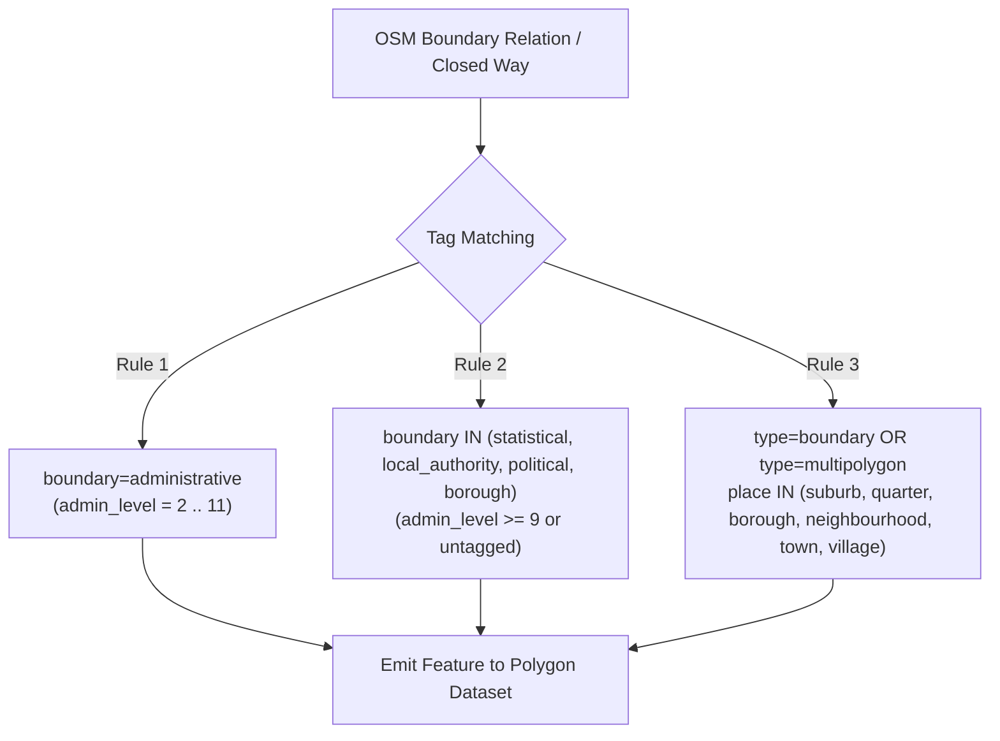
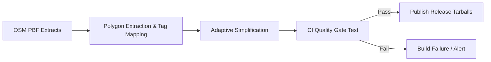

# Specification: Sub-Municipal Boundary Extraction & Simplification in `osm-polygons`

**Target Project:** `https://github.com/krizleebear/osm-polygons` (`osm-tools`)  
**Consumer Project:** `osm-geocoder`  
**Date:** 2026-08-16  
**Status:** Partial Implementation (filter + synthesis + geometry guard done in `osm-polygons`; adaptive per-admin-level simplification tolerances implemented + verified in `osm-tools`; image rebuild/repush and CI quality gates pending — see §7, §8)  

---

## 1. Executive Summary & Objective

In `osm-geocoder`, administrative point-in-polygon hierarchy resolution expects larger cities and municipalities to resolve sub-municipal administrative districts (`CITYPART`), in which streets and POIs are nested:
$$\text{COUNTRY} \longrightarrow \text{STATE} \longrightarrow \text{CITY} \longrightarrow \text{CITYPART} \longrightarrow \text{AREACODE} \longrightarrow \text{STREET} \longrightarrow \text{POI}$$

### The Problem
An audit of current polygon datasets (`data/osm-polygons/simplified/`) revealed that **80.8% of Bavarian cities** and numerous medium-to-large cities across Germany and worldwide have **0 resolved city districts** (`CITYPART = 0`).

Examples of affected major/medium cities with missing sub-divisions:
- **Bayern:** Regensburg (7,906 POIs), Bamberg (4,134 POIs), Rosenheim (3,550 POIs), Passau (3,257 POIs), Kempten (3,153 POIs), Schweinfurt (2,770 POIs), Weiden i.d.OPf. (2,259 POIs), Memmingen (2,145 POIs), Ansbach (2,044 POIs).
- **Rheinland-Pfalz:** Kaiserslautern (4,329 POIs), Neuwied (2,534 POIs).
- **Mecklenburg-Vorpommern:** Schwerin (4,328 POIs).
- **International:** Large cities in Thailand (TH, Bangkok Khet), Egypt (EG), Tunisia (TN), Japan (JP), Australia (AU), etc.

### The Objective
Enhance the `osm-polygons` exporter to:
1. Broaden boundary extraction filters to capture sub-municipal polygons (OSM `admin_level` 9, 10, 11 as well as statistical/borough boundary relations).
2. Adjust geometry simplification tolerances so small inner-city districts are not dropped or geometrically distorted.
3. Preserve all critical tagging metadata (names, AGS/regional codes, postal codes, wikidata).
4. Implement automated quality gates in `osm-polygons` CI to prevent missing-level regressions.

---

## 2. Extraction & Filtering Rules in `osm-polygons`

Currently, `osm-polygons` filters predominantly for `boundary=administrative` relations. In OpenStreetMap, sub-municipal districts (Stadtbezirke, Stadtteile, Ortsteile, Statistische Bezirke, Suburbs, Quarters) are mapped using several tagging conventions.

### 2.1 Filter Predicates (Inclusion Criteria)

The exporter must extract OSM relations and closed ways matching **any** of the following conditions:



#### Rule 1: Administrative Boundaries (Standard)
- `boundary=administrative` with `admin_level` $\in [2, 11]$.

#### Rule 2: Statistical & Local Authority Boundaries
Many German kreisfreie Städte (e.g. Regensburg, Bamberg, Nürnberg, Augsburg) and international cities define their official municipal districts via statistical or local authority boundaries:
- `boundary=statistical` OR `boundary=local_authority` OR `boundary=political` OR `boundary=borough`
- With `admin_level` $\ge 9$ OR without `admin_level` tag (in which case a default `admin_level="10"` is assigned).

#### Rule 3: Place-Based Boundary Relations
- Relations tagged with `type=boundary` or `type=multipolygon` combined with:
  - `place=suburb` $\longrightarrow$ mapped to default `admin_level="9"`
  - `place=quarter` $\longrightarrow$ mapped to default `admin_level="10"`
  - `place=neighbourhood` $\longrightarrow$ mapped to default `admin_level="11"`
  - `place=borough` $\longrightarrow$ mapped to default `admin_level="9"`

---

## 3. Property & Tag Preservation Requirements

To ensure full compatibility with `osm-geocoder`'s [`BoundaryPolygonParser`](file:///app/src/main/java/net/leberfinger/osm/cache/BoundaryPolygonParser.java) and [`HierarchyResolver`](file:///app/src/main/java/net/leberfinger/osm/cache/HierarchyResolver.java), the GeoJSON `properties` object of each emitted feature **must** contain:

| GeoJSON Property | Source OSM Tag | Mandatory | Description / Example |
|---|---|:---:|---|
| `@id` | Relation / Way ID | **Yes** | Unique integer ID (e.g. `62411`). |
| `@type` | Element type | **Yes** | `"relation"` or `"way"`. |
| `admin_level` | `admin_level` | **Yes** | String integer (`"2"` to `"11"`). Synthesized if missing (see 2.1). |
| `boundary` | `boundary` | **Yes** | `"administrative"`, `"statistical"`, `"local_authority"`, etc. |
| `name` | `name` | **Yes** | Primary local name (e.g. `"Kumpfmühl-Ziegetsdorf-Neuprüll"`). |
| `name:de`, `name:en`, ... | `name:*` | No | Multilingual alt-names for `<ALT_NAME>` streaming. |
| `alt_name`, `official_name` | `alt_name`, `official_name` | No | Alternative/official names. |
| `postal_code` | `postal_code` / `addr:postcode` | No | Postcode fallback (e.g. `"93051"`). |
| `de:amtlicher_gemeindeschluessel` | `de:amtlicher_gemeindeschluessel` / `de:regionalschluessel` | No | AGS key (e.g. `"09362000"`). |
| `wikidata` / `wikipedia` | `wikidata` / `wikipedia` | No | Semantic IDs (e.g. `"Q2978"`). |

> [!IMPORTANT]
> **Property Unnamed Filtering:** Ensure features without a valid `name` or `name:en` or `name:de` tag are filtered out unless they represent national land borders (`admin_level=2` with `ISO3166-1`).

---

## 4. Adaptive Polygon Simplification

Sub-municipal districts (Stadtbezirke / Ortsteile) can be geographically small ($\text{area} < 1\,\text{km}^2$). A static simplification tolerance suitable for entire countries or states (e.g. $\varepsilon = 0.001^\circ \approx 100\,\text{m}$) would collapse or completely erase small urban polygons.

### 4.1 Recommended Adaptive Simplification Tolerances

Use Douglas-Peucker or Visvalingam-Whyatt with topology preservation (e.g. JTS `TopologyPreservingSimplifier` or Mapshaper `-simplify dp keep-shapes`):

| Admin Level Category | Typical Area | Max Simplification Tolerance $\varepsilon$ | Min Vertex Count | Min Area Threshold |
|---|---|---|:---:|:---:|
| **Level 2–4** (Country, State) | $> 5,000\,\text{km}^2$ | $\approx 0.0005^\circ$ (~50 m) | $\ge 4$ | $> 1\,\text{km}^2$ |
| **Level 5–8** (County, City/Gemeinde) | $10 - 5,000\,\text{km}^2$ | $\approx 0.0002^\circ$ (~20 m) | $\ge 4$ | $> 0.01\,\text{km}^2$ |
| **Level 9–11** (Stadtbezirk, Ortsteil) | $0.05 - 50\,\text{km}^2$ | $\approx 0.00005^\circ$ (~5 m) | $\ge 4$ | **Do NOT drop by area** |

> [!NOTE]
> **Min-Area thresholds are orientation values, NOT hard drop rules.** Enforcing a minimum area for levels 2–4 (e.g. `> 1 km²`) would delete legitimate sovereign micro-states (Vatican City ≈ 0.44 km², Monaco ≈ 2 km²). The current simplifier never drops features by area; this behavior must be preserved.

### 4.2 MultiPolygon & Ring Invariants
- Outer rings must follow standard GeoJSON counter-clockwise orientation; inner rings (holes/enclaves) must follow clockwise orientation.
- Geometry types must strictly be `Polygon` or `MultiPolygon`. (Point, LineString, and GeometryCollection features must be stripped during export).

---

## 5. Output Format & Packaging

### 5.1 GeoJSONSeq / GeoJSONL Spec
- **File extension:** `.admin-polygons.simplified.geojsonseq` (or `.admin-polygons.geojsonseq`).
- **Encoding:** Strict UTF-8 without BOM, one complete GeoJSON `Feature` per line (no pretty-printed multiline JSON).
- **Coordinate precision:** 6–7 decimal places (e.g. `12.0944841, 49.0016409`), WGS84 (`EPSG:4326`).

### 5.2 Release Tarballs
- `simplified-all.tar.gz` (Worldwide dataset containing all ISO country files).
- `simplified-europe.tar.gz` (European dataset, e.g. `DE_germany.admin-polygons.simplified.geojsonseq`, `AT_austria...`, `FR_france...`).

---

## 6. Automated Quality Assurance & CI Validation

The `osm-polygons` build pipeline should incorporate automated validation tests prior to publishing a release:



### 6.1 Quality Gate Assertions

1. **Top Cities District Check (Germany):**
   - For all 107 German kreisfreie Städte (e.g. Munich, Nuremberg, Regensburg, Bamberg, Augsburg, Würzburg, Schwerin, Kaiserslautern):
     $$\text{Count}(\text{polygons within city bbox with } \text{admin\_level} \in \{9, 10\}) \ge 1$$
2. **No Empty Admin Levels where OSM Data Exists:**
   - Assert that `admin_level=9` count for Germany is $\ge 12,000$ (currently ~10,032).
   - Assert that `admin_level=10` count for Germany is $\ge 10,000$ (currently ~7,737).
3. **Valid Geometries:**
   - JTS `geometry.isValid()` must be `true` for 100% of emitted polygons.
   - No `NaN` or out-of-bounds coordinates ($[-180, 180], [-90, 90]$).

> [!NOTE]
> **Gate thresholds must be calibrated against OSM data availability BEFORE enforcement.** An empirical audit (Bayern PBF, 2025-11) shows many cities (e.g. Regensburg) have **no** sub-municipal polygon in OSM at all — only `place` nodes. The §6.1 "≥ 1 Bezirk" gate for all 107 kreisfreie Städte would therefore fail permanently on missing data, not on regressions. First audit per city how many district polygons OSM actually provides; enforce the gate only for cities where data exists, or treat it as a regression-tracking threshold.

---

## 7. Implementation Checklist for `osm-polygons`

1. [x] **Update Filter Configuration:** Add `boundary IN (statistical, local_authority, borough, political)` and `place IN (suburb, quarter, borough)` to relation extract filter in `osm-tools`.
   - Implemented in `osm-polygons` (2026-08-16): broad `osmium tags-filter` expression + precise refinement and `admin_level` synthesis in `scripts/filter_polygons.py` (see §8.1).
2. [x] **Adjust Simplification Rules:** Lower the simplification epsilon for levels 9–11 to preserve small Stadtbezirk geometries.
   - Implemented in `osm-tools` (2026-08-17): adaptive per-admin-level tolerances in `GeoJSONSimplify` (`TOLERANCE_LEVEL_2_4=0.0005`, `TOLERANCE_LEVEL_5_8=0.0002`, `TOLERANCE_LEVEL_9_11=0.00005`, see §4.1), applied per feature in `resolveTolerance()`/`simplifyGroup()` and via the JTS `CoverageSimplifier.simplify(double[])` per-element tolerance array. Verified on the Bayern export (2026-08-17): levels 9–11 retain ~2.1–2.6x more vertices than the old global 0.001 tolerance; coverage failures dropped 8 → 4 (all 4 remaining are pre-existing communal-forest/enclave quirks, none newly introduced). Requires image rebuild + repush before the pipeline picks it up (see §8.4).
3. [ ] **Run Test Export on Germany (`DE_germany`):** Verify that Regensburg, Bamberg, Passau, Rosenheim, Schwerin, Kaiserslautern show their respective Stadtbezirke/Ortsteile.
   - Partially verified locally on Bayern (2026-08-16): filter broadens output (+lvl9/10/11 counts) and geometry guard removes Point/LineString leaks, but Regensburg shows no Stadtbezirk polygons → data-availability gap (see §8.3).
4. [ ] **Verify in `osm-geocoder`:** Run `HierarchyAudit` on `DE_Bayern_geocoder.xml` to confirm that Regensburg et al. resolve with their `CITYPART` children.

---

## 8. Feasibility Assessment & Implementation Notes

**Date:** 2026-08-16  
**Verdict:** Feasible. The extraction and synthesis changes are low-risk and implemented in `osm-polygons`. The dominant risk is **OSM data availability**, not extraction technology.

### 8.1 osmium tags-filter has no boolean AND

Filter expressions in `osmium tags-filter` are OR-combined; `(type=boundary OR type=multipolygon) AND place IN (...)` cannot be expressed in a single expression.

Implemented strategy:
- **Broad filter** in osmium:
  ```
  boundary=administrative
  boundary=statistical,local_authority,political,borough
  r/place=suburb,quarter,borough,neighbourhood
  ```
- **Precise refinement** in `scripts/filter_polygons.py`: relation-type check, `admin_level` synthesis, geometry guard, tag preservation.

### 8.2 Geometry guard (Point/LineString leakage)

`osmium tags-filter` automatically includes referenced member nodes/ways; `osmium export` then emits them as `Point`/`LineString` features. With the broader `r/place=...` filter this leakage grows significantly (Bayern: 4 LineStrings → 178). `filter_polygons.py` now drops every non-`Polygon`/`MultiPolygon` feature (spec §4.2).

### 8.3 Empirical finding: data availability is the real bottleneck

Smoke test on the Bayern PBF (2025-11) with the implemented filter:
- Level 9: 61 → 124 features, Level 10: 205 → 614, Level 11: 98 → 372.
- **Regensburg has NO sub-municipal polygon** in the extract (only `place` nodes exist in OSM); the same applies to several named cities. The premise "80.8% of Bavarian cities → 0 CITYPART because the filter is too narrow" is only **partially** correct.
- `boundary=political` in Bayern (43 features, e.g. "Regensburg", "München West") are **electoral districts (Wahlkreise)**, not Stadtbezirke — they may pollute `CITYPART` resolution and should be re-evaluated before release.

**Consequence:** Filter broadening alone will NOT reach full city coverage. §6 quality gates must be calibrated to actual OSM data (see §6.1 note).

### 8.4 osm-tools image dependency (per-level tolerances)

Per-level simplification tolerances (§4.1) live in `osm-tools` (`GeoJSONSimplify.process()`; hierarchy groups are already keyed by `admin_level` via `getHierarchyGroupKey`). Implemented 2026-08-17 as adaptive per-feature tolerances (`resolveTolerance()` → `getAdminLevelTolerance()`, fed into both the `TopologyPreservingSimplifier` fallback path and the JTS `CoverageSimplifier.simplify(double[])` per-element tolerance array; shared coverage edges use the lowest adjacent tolerance, so fine detail wins). The remaining steps require:
- Rebuild + repush of `krizleebear/osm-tools` (Docker Schema 2 / `mirror.gcr.io`, per `AGENTS.md`).
- Pinning `:latest` in `polygon-export-pipeline.yml` for reproducibility.

**Implementation note (nested `properties`):** `GeoJSON.properties` stores the whole GeoJSON feature minus `geometry`, i.e. `admin_level` lives nested under a `properties` member. `getAdminLevelTolerance()` must unwrap this member before reading `admin_level`; without the unwrap the adaptive tolerance silently falls back to the global tolerance (initial empirical run showed byte-identical output for that reason). Covered by `getAdminLevelTolerance`/`resolveTolerance`/`processAppliesAdaptiveTolerance` tests in `osm-tools`.

### 8.5 German `admin_level` inconsistency

Sub-municipal districts are mapped per state as `admin_level` 8, 9, 10 or as `boundary=statistical` without `admin_level`. Rule 2/3 synthesis (§2.1) in `filter_polygons.py` is therefore the core of the feature and already implemented.

### 8.6 Volume growth

Adding statistical + place features grows the German dataset by roughly +15–20k features. Simplify runtime and the 360 min job timeout must be monitored on the next full run.
