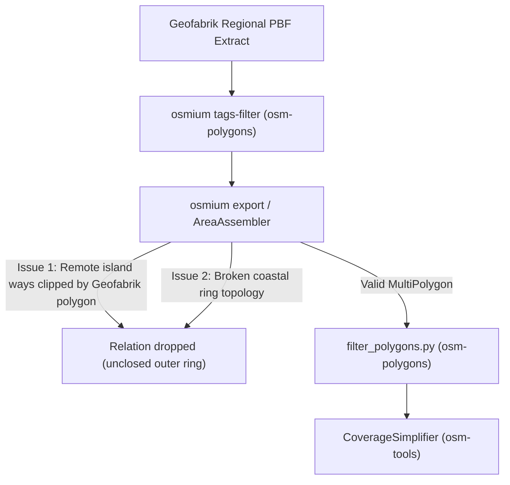

# Specification: Missing Major Administrative Entities & Island Municipalities in `osm-polygons`

**Target Project:** `https://github.com/krizleebear/osm-polygons`  
**Downstream Projects:** `osm-tools`, `osm-geocoder`  
**Date:** 2026-08-18  
**Status:** Ready for Implementation (Target: `osm-polygons` Release `v1.9`)  

---

## 1. Context & Motivation

`osm-geocoder` adheres to the **Realworld Geocoding Principle**: Every major city, district capital, and well-known municipality must be faithfully discoverable at its natural administrative level in the generated geocoder XML.

During systematic coverage validation with `XmlContentValidator`, we identified that certain prominent global cities and regional entities are missing in the simplified boundaries dataset (`v1.8`), despite their sub-divisions (parishes/districts) being present.

> [!IMPORTANT]
> To prevent data masking, `osm-geocoder` strictly enforces presence checks for these cities. The root cause must be resolved during boundary extraction in `osm-polygons`.

---

## 2. Identified Deficiencies in `v1.8` Dataset

### Case 1: Portugal / Madeira — Missing Concelho Funchal (`admin_level=7`)

- **Entity:** Município do Funchal (Capital and largest city of the Autonomous Region of Madeira)
- **OSM Relation ID:** [`relation/8421413`](https://www.openstreetmap.org/relation/8421413)
- **Tags:**
  ```text
  boundary = administrative
  admin_level = 7
  type = boundary
  name = Funchal
  official_name = Município do Funchal
  wikidata = Q25444
  ```
- **Observed Defect in `PT_portugal.admin-polygons.geojsonseq`:**
  - 10 out of 11 concelhos on Madeira (`admin_level=7`) are correctly present (*Calheta, Câmara de Lobos, Machico, Ponta do Sol, Porto Moniz, Porto Santo, Ribeira Brava, Santa Cruz, Santana, São Vicente*).
  - Relation `8421413` (*Funchal*) is **completely missing**.
  - All 10 child parishes (*Freguesias*, `admin_level=8`) of Funchal (*São Martinho, Santa Maria Maior, São Pedro, São Roque, Santo António, Santa Luzia, Monte, Imaculado Coração de Maria, São Gonçalo, Sé*) are present.
- **Impact on Geocoder:**
  - POIs in Funchal are indexed under parish names (e.g. `<CITY NAME="São Martinho">`), but `<CITY NAME="Funchal">` is never generated.

---

### Case 2: Taiwan — Missing Special Municipality Kaohsiung (`admin_level=4`)

- **Entity:** Kaohsiung City (高雄市, Southern Taiwan's primary metropolitan hub)
- **OSM Relation ID:** [`relation/2127079`](https://www.openstreetmap.org/relation/2127079)
- **Tags:**
  ```text
  boundary = administrative
  admin_level = 4
  type = boundary
  name = 高雄市
  name:en = Kaohsiung City
  ISO3166-2 = TW-KHH
  wikidata = Q181557
  ```
- **Observed Defect in `TW_taiwan.admin-polygons.geojsonseq`:**
  - All other special municipalities and counties in Taiwan (*Taipei, New Taipei, Taichung, Tainan, Taoyuan City, Keelung, Hsinchu, Chiayi*) are present at `admin_level=4`.
  - Relation `2127079` (*Kaohsiung City*) is **completely missing** at level 4.
  - The 38 constituent districts (*Sanmin, Lingya, Gushan, Xinxing, Fengshan, etc.*) are present at `admin_level=7`.
- **Impact on Geocoder:**
  - Kaohsiung City is not recognized as a primary administrative division/state entity.

---

## 3. Architecture & Root Cause Analysis

### Pipeline Responsibilities

1. **Extraction & Assembly (`osm-polygons`):**
   `osmium-tool` (`osmium tags-filter` & `osmium export`) extracts OSM relations and assembles MultiPolygons from `.osm.pbf`. [`filter_polygons.py`](file:///Users/krizleebear/development/osm-polygons/scripts/filter_polygons.py) normalizes tags, handles mainland aliases, and filters invalid elements.
2. **Simplification & Verification (`osm-tools`):**
   [`GeoJSONSimplify.java`](file:///Users/krizleebear/development/osm-tools/src/main/java/net/leberfinger/geo/GeoJSONSimplify.java) runs `CoverageSimplifier` and enforces strict 1:1 feature count preservation (`GeoJSONSimplifyVerifier`). It never drops features.

### Root Causes for Missing Entities in `osmium export`



1. **Geofabrik Spatial Bounding Clipping:**
   - Kaohsiung City (`relation/2127079`) includes remote island territories in the South China Sea (Dongsha / Pratas Island at 20.7°N, Taiping Island at 10.4°N). Geofabrik's `taiwan-latest.osm.pbf` spatial extract polygon excludes these distant locations, omitting their outer ways from the PBF. Libosmium's `AreaAssembler` cannot close the outer ring and drops the entire relation.
   - Funchal (`relation/8421413`) includes the uninhabited *Ilhas Desertas* (~25 km off Madeira) and complex maritime coastal ways with topological gaps.
2. **Sub-Divisions Are Intact:**
   - Child entities (Funchal freguesias at level 8, Kaohsiung districts at level 7) are confined to the continuous landmass and assemble cleanly.

---

## 4. Requirements & Implementation Tasks

### 4.1 Synthetic Parent Reconstruction (`osm-polygons`)

When a major parent administrative division fails to assemble during `osmium export`, [`filter_polygons.py`](file:///Users/krizleebear/development/osm-polygons/scripts/filter_polygons.py) must reconstruct the missing parent entity by performing a geometric union (`unary_union`) of its constituent child divisions:

1. **Declared Known Entities:**
   Define target parent configurations for critical entities (e.g. Funchal `admin_level=7`, Kaohsiung `admin_level=4`) with their official attributes (`id`, `name`, `wikidata`, `admin_level`, `ISO3166-2`).
2. **Dynamic Child Aggregation:**
   If the parent entity is missing in the feature stream, aggregate all child polygons belonging to the parent's territory, merge them via `shapely.ops.unary_union`, and emit the synthesized parent feature.
3. **Diagnostic Logging:**
   Log `osmium export` stderr to capture dropped relations:
   ```bash
   osmium export ${ADMIN_PBF} --output-format=geojsonseq --config=osmium-export-config.json 2> export_errors.log
   ```

---

## 5. Acceptance Criteria for `osm-polygons` Release `v1.9`

- [ ] `PT_portugal.admin-polygons.simplified.geojsonseq` contains relation `8421413` (`name: "Funchal"`, `admin_level: "7"`, `wikidata: "Q25444"`).
- [ ] `TW_taiwan.admin-polygons.simplified.geojsonseq` contains relation `2127079` (`name: "高雄市"`, `admin_level: "4"`, `ISO3166-2: "TW-KHH"`, `wikidata: "Q181557"`).
- [ ] Automated regression tests in `osm-polygons` (`test_filter_polygons.py`) verify the synthetic parent reconstruction mechanism.
- [ ] `osm-geocoder` `XmlContentValidator` passes full verification for `PT` and `TW` without missing major cities.
