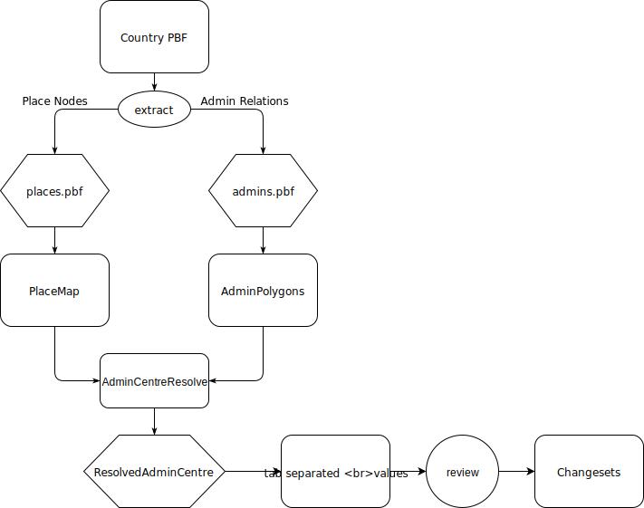

# AdminCentre resolver

## Proposed OSM bot: AdminCentre linking

I propose to link place nodes to their respective admin relation in an
automated manner.

### Status quo

  - I've seen that there's a lot of administrative regions and a lot of
    place nodes. But there is a huge gap in linking them together.
  - Manually adding 'admin\_centre' members to relations is a tedious
    job. I've tried both iD and JOSM editors. Although both are really
    comfortable editors for other use cases, linking place nodes and
    relations is extremely time intensive.
  - To fill the gap I've implemented an automatic resolver that I
    published on
    [Github](https://github.com/krizleebear/osm-polygons/tree/master/osm-admincentre-resolve).
  - To broaden the effect I think it's a good idea to submit the
    resolved links directly to OSM source data. I will document the
    whole approach and publish it via import list before performing any
    changes.
    
#### Example: Germany

  - ~19000 admin relations (I only count the ones with admin_level and
    wikidata tags)
  - only ~9100 of these relations have a relation member with role
    "admin_centre" or "label"
  - in contrast to that there are ~150 000 place nodes defined

### Goals

1.  easier handling of geocoding tasks
2.  be better than geographical center of the polygons
3.  improve the visibility of place nodes acting as admin\_centres
4.  set basis for further improvements

### Non-Goals

Some of these could be goals for later approaches

1.  I won't move or improve position of centre nodes
2.  I won't check whether centre node is inside of landuse area
3.  I won't remove duplicate place nodes

### Solution concept

1.  take PBF and extract admin relations and place nodes to separate
    files
2.  combine admins and places via position and name. A place node must
    be inside of its respective admin boundary.
3.  review generated mappings
4.  if required, remove opted-out IDs
5.  upload mappings to OSM in small batches (e.g. one changeset for each
    county)

### Implementation details

The solution is implemented in Java. I'm using the following tools and
libs to solve the problem:

1.  Osmium to extract relevant admin relations and place nodes to
    separate files
2.  osm4j to read place nodes
3.  index all place nodes in an R-Tree (JTS STRTree)
4.  use osm4j to read admin relations to JTS polygons
    1.  for each imported polygon:
    2.  if the admin relation has admin\_level \< 6, ignore it
    3.  if the admin relation already has an admin\_centre member,
        ignore it
    4.  query the R-tree for all covered place nodes
    5.  search for place node with the same name as the admin relation
5.  write a table with mapped IDs of admin relations and place nodes
6.  TODO: create changesets

### Examples

- An 1000 line example of resolved admin\_centres can be found here:
[admins-resolved-germany-sample.tsv](https://github.com/krizleebear/osm-polygons/blob/master/examples/admins-resolved-germany-sample.tsv)

- The full result for Germany is
[here](https://raw.githubusercontent.com/krizleebear/osm-polygons/master/examples/admins-resolved-germany.tsv)
